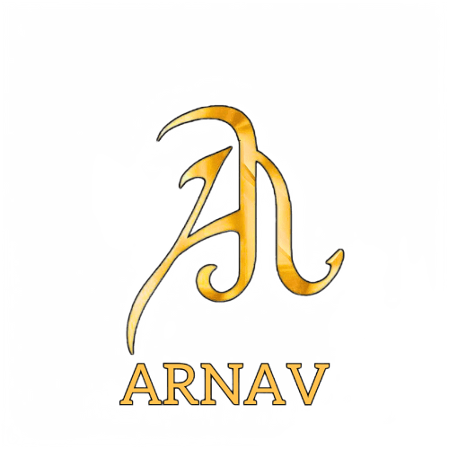

<h1 align="center">Hi 👋, I'm Arnav Asthana</h1>
<h3 align="center">A passionate full stack developer from India</h3>

  

  

<h2>

- 🔭 I’m currently working on **Web Development**

- 🌱 I’m currently learning **machine learning and AI, exploring their applications in web development and beyond**

- 👯 I’m looking to collaborate on **Full Stack Developmemt**

- 👨‍💻 All of my projects are available at [https://arnav-asthana.netlify.app/](https://arnav-asthana.netlify.app/)

- ⚡ Fun fact **I am a basketball player too😊.**
</h2>

 

# Connect with me:

# 💻 Tech:

## Frontend

  
  
  
  
  
   
  

## Backend

  
  

  
  

## Tools

  
   
  
 
  

 

  

&nbsp;

  

